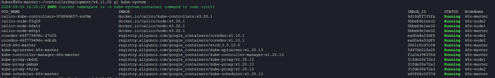

&emsp; &emsp; 该脚本主要用于日常工作中，一键获取Kubernetes指定**命名空间**下对应的Pod名称、使用的镜像、镜像ID、当前Pod运行状态，Pod所在节点，方便核对所使用的镜像信息，支持以下container runtime
- docker
- containerd

  &emsp; &emsp; 示例如下所示：
  

## 1.注意事项 
- 依赖外部组件  [jq](https://stedolan.github.io/jq/)
- 使用该命令需要在kubernetes 的master 节点
- 若IMAGE_ID为Unknown，则代表当前节点没有该镜像

## 2.快速用法

&emsp; &emsp; 下载该脚本至服务器

```shell
sudo chmod +x get_image_for_k8s.sh && sudo mv get_image_for_k8s.sh /usr/local/bin/gi
```

> 以上将默认命名空间为`kube-system`下面对应的Pod、镜像信息

## 3.获取指定命名空间

&emsp; &emsp; 如果指定命名空间，标准用法为 gi `ns_name`

```shell
gi kube-system
```
  
